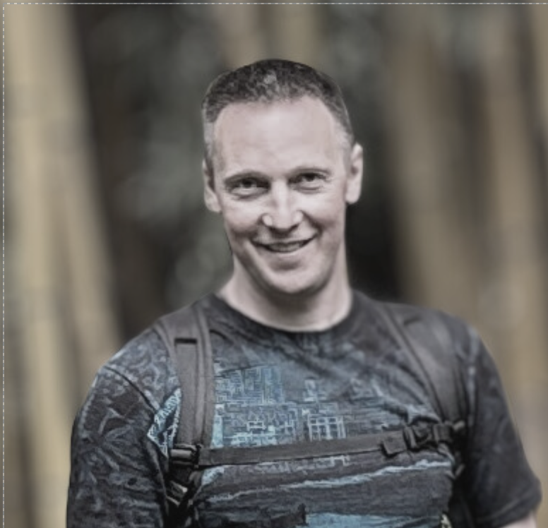
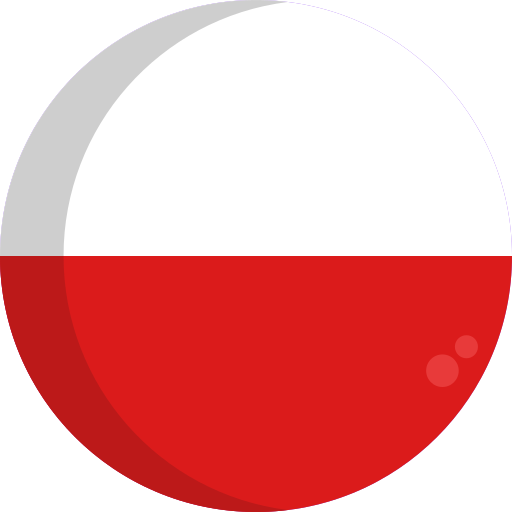

---

# Привет, меня зовут Игорь! 

<table align="center">
  <tr>
    <td></td>
    <td>
      <pre><code>
      UAHIG { 
        position: Poland; 
        height: 187cm; 
        display: boy; 
        background: engineer; 
        color: white;
      }
      </code></pre>
    </td>
    <td></td>
    <td>
      <table>
        <tr>
          <td><a href="README.md"> English</a></td>
        </tr>
        <tr>
          <td><a href="README_ua.md">Ukraine</a></td>
        </tr>
        <tr>
          <td><a href="README_pl.md"> Polska</a></td>
        </tr>
         <tr>
          <td><a href="README_ru.md">Russian</a></td>
        </tr>
      </table>
    </td>
  </tr>
</table>

---

### :man_technologist: Немного о себе: 

В настоящее время я занимаюсь изучением программирования, и как творческая личность, меня вдохновляют перспективы работы на позиции Frontend Developer.

Моя карьера началась в 2005 году, в должности инженера-конструктора. С 2007 года я трудился в инновационной компании по производству гибкой упаковки и постепенно продвигался от инженера по подготовке производства до должности Главного технолога.

Я стремлюсь к самосовершенствованию и постоянно расширяю свои знания и навыки. Моя цель - профессиональный рост и достижение выдающихся результатов, способствующих успеху компании. Я готов взять на себя ответственность и работать в динамичной среде, где я могу внести свой вклад и профессионально развиваться.

<p align="center">
 
</p>

- :telescope: Java Script learn.javascript.ru Course !

- :seedling: EPAM Front-End Self-Paced Online Program!

- :zap: RS School Course «JavaScript/Front-end. Stage 0» (in progress)

- :mailbox: Contact me: [](https://t.me/bor_kit) [](mailto:golosnyyigor@gmail.com) 

---

### 🤝 Social natworks:

  <div id="badges">
    <a href="https://www.linkedin.com/in/uahig" target="_blank">
      
    </a>&nbsp
    <a href="https://www.youtube.com/channel/UCgcxZzGi8XoV2yLlTaeqKXw" target="_blank">
      
    </a>&nbsp
    <a href="https://www.facebook.com/igor.golosnyy" target="_blank">
      
    </a>&nbsp
  </div>

---

### 💻 Technologies:

<div>
  &nbsp
  &nbsp
  &nbsp
  &nbsp
  &nbsp
  &nbsp
 <!-- &nbsp -->
 <!-- &nbsp -->
 <!-- &nbsp -->
 <!-- &nbsp -->
 <!-- &nbsp; -->
 <!-- &nbsp; -->
 <!-- &nbsp; -->
 <!-- &nbsp; -->
</div>

---

### Code example: 
```javascript
function Counter() { let count = 0;
this.up = function() { return ++count; }; this.down = function() { return –count; }; }
let counter = new Counter();
alert( counter.up() ); alert( counter.up() ); alert( counter.down() );
```
### 🛠 Tools:

<div>
 <!-- &nbsp; -->
  &nbsp;
  &nbsp;
  &nbsp;
  &nbsp;
  &nbsp;
  &nbsp;
  <!-- &nbsp; -->
</div>

---

 ### 💻 Courses:

| Course:                                                         | Date:             |
| ----------------------------------------------------------------| :---------------: |
| Java Script learn.javascript.ru Course                          | 02/2022 - 05/2022 |
| EPAM Front-End Self-Paced Online Program                        | 03/2022 - 08/2022 |
| RS School Course «JavaScript/Front-end. Stage 0»                | 07/2023 - 10/2023 |

### Languages:

- **Английский:** B1 INTERMEDIATE to B2 UPPER INTERMEDIATE, according to the guidelines set by the Common European Framework of Reference (CEFR).
- **Русский:** Родной
- **Украинский:** Родной
- **Польский** - В процессе изучения..

---

### 💻 Codewars:


### ⚙️ GitHub statistics:

<table>
  <tr>
    <td>
      
    </td>
    <td>
      
    </td>
  </tr>
</table>

<!-- ] -->


